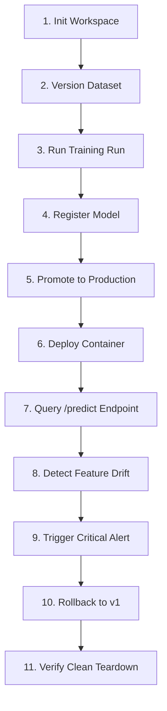

# 🚀 End-to-End (E2E) Full Lifecycle Testing

> **Component:** `tests/e2e/test_full_lifecycle.py`  
> **Milestone:** M7 — Quality & CI/CD (Issue #30)  
> **Scenario:** Complete 11-Step Production Journey

---

## Overview

The **End-to-End (E2E) Test Suite** validates that all decoupled platform components (CLI, Registry, Tracking, Deployment, Monitoring, Alerting, and Rollback) integrate into a unified, reliable user experience.



---

## The 11-Step Lifecycle Verification Journey

| Step | Stage | Action Taken | Assertion / Success Criteria |
| :-: | :--- | :--- | :--- |
| **1** | **Workspace** | `mlite init credit-risk` | Creates `.mlite/` config and project scaffolding |
| **2** | **Data** | Register `data.csv` | Dataset registered with SHA-256 hash and format validated |
| **3** | **Training** | Scikit-Learn training experiment | Hyperparameters logged to MLflow; `accuracy >= 0.80` |
| **4** | **Registry** | Register model artifact | Model artifact staged to registry under unique version ID |
| **5** | **Promotion** | Promote to `PRODUCTION` | Stage transitions to `PRODUCTION`; previous versions demoted |
| **6** | **Serving** | Launch container via `mlite deploy` | Port allocated, container starts with `status: RUNNING` |
| **7** | **Inference** | Probe `/predict` endpoint | Returns predictions with probability scores and latency `< 50ms` |
| **8** | **Monitoring** | Ingest shifted feature distribution | Kolmogorov-Smirnov test detects drift (`p < 0.05`) |
| **9** | **Alerting** | Evaluate drift thresholds | Dispatches `HIGH` severity alert to configured channels |
| **10**| **Rollback** | Deploy faulty v2 & trigger rollback | Cutover production port back to v1 without dropping traffic |
| **11**| **Teardown** | Validate final state & cleanup | Audit entry recorded (`status: COMPLETED`); containers stopped |

---

## Running the E2E Test Suite

Run the full lifecycle test:
```bash
pytest tests/e2e/test_full_lifecycle.py -v
```

### With Live Docker Daemon
If executing in an environment with Docker daemon access:
```bash
pytest tests/e2e/test_full_lifecycle.py -v --capture=no
```

### Safety & Teardown Guarantees
- Tests execute inside a unique `tmp_path` scratch directory.
- Container operations are bounded by timeout protection (120s max).
- Every container launched is guaranteed to be terminated during test teardown.
