# Retail Demand Forecasting Tutorial

This tutorial demonstrates building, training, deploying, and continuously evaluating a **Store Demand Forecasting** model with MLite, including handling delayed ground-truth feedback.

```mermaid
flowchart LR
    A[Daily Sales Generator] -->|Train & Test Sets| B[MLite Data Registry]
    B --> C[RandomForest Time-Series Model]
    C -->|RMSE, MAE & Artifacts| D[MLflow Run & Model Registry]
    D --> E[Inference Container :8200]
    E -->|Predictions| F[Client Application]
    F -.->|Actual Sales Next Day| G[MLite Feedback API]
    G --> H[Live RMSE & Drift Evaluation]
```



---

## 1. Overview

Demand forecasting is a time-series regression task with unique production operational needs:
- Feature pipelines require sliding-window statistics (`lag_1`, `lag_7`, `rolling_mean_7`).
- Predictions are served in real time, but true labels (units sold) only arrive after the sales day closes.
- Performance evaluation depends on delayed ground-truth ingestion via `/api/v1/deployments/{id}/feedback`.

---

## 2. Directory Structure

The complete source code is located in [`examples/demand-forecasting/`](file:///home/youssef/Music/MLOpsLite/examples/demand-forecasting):

```text
examples/demand-forecasting/
├── mlite.yaml                # Project metadata
├── requirements.txt          # Python dependencies
├── README.md                 # Quickstart guide
└── src/
    ├── generate_data.py      # Time-series synthetic dataset generator
    ├── train.py              # MLflow model training & evaluation
    └── simulate_sales.py     # Live inference & feedback simulation
```

---

## 3. Step-by-Step Instructions

### Step 3.1: Environment Setup

```bash
cd examples/demand-forecasting
pip install -r requirements.txt
```

### Step 3.2: Generate Time-Series Data

Run the generator to create train and test splits with lagged features:

```bash
python src/generate_data.py
```

Output:
```text
✔ Generated demand forecasting datasets:
  • Train set: data/daily_sales_train.csv (1440 records)
  • Test set:  data/daily_sales_test.csv (480 records)
```

Register the training split with MLite:

```bash
mlite data register \
  --name store-demand-train \
  --path data/daily_sales_train.csv \
  --description "140-day store sales with 7-day lags"
```

### Step 3.3: Train Model with MLflow Tracking

Execute `src/train.py` to fit a `RandomForestRegressor` and record evaluation metrics:

```bash
python src/train.py
```

Logged metrics:
- **RMSE**: ~6.8 units
- **MAE**: ~5.1 units
- **R² Score**: > 0.88

The artifact is saved to `models/demand_forecaster.pkl`.

### Step 3.4: Register and Deploy to Serving

Register the model:

```bash
mlite models register \
  --name demand-forecaster \
  --version 1 \
  --artifact-uri "models/demand_forecaster.pkl" \
  --framework scikit-learn \
  --description "Store-level daily demand predictor"
```

Deploy the model container to port `8200`:

```bash
mlite deployments create \
  --name demand-forecaster-prod \
  --model demand-forecaster \
  --version 1 \
  --port 8200
```

Verify the endpoint is operational:

```bash
curl http://localhost:8200/health
```

### Step 3.5: Run Live Inference and Delayed Feedback

Simulate store transactions, collect forecasts, and post delayed actual sales to the feedback endpoint:

```bash
python src/simulate_sales.py --port 8200 --deployment-id demand-forecaster-prod --queries 15
```

The script performs two operations per sample:
1. Calls `POST http://localhost:8200/predict` with current store lag features.
2. Ingests delayed actual sales into `POST http://localhost:8000/api/v1/deployments/demand-forecaster-prod/feedback`:

```json
{
  "prediction_id": "sales-pred-0001",
  "ground_truth": 84.0,
  "predicted_value": 81.2,
  "latency_ms": 11.4
}
```

### Step 3.6: Verify Feedback Metrics

Query the live realized metrics computed by the performance monitor:

```bash
curl http://localhost:8000/api/v1/deployments/demand-forecaster-prod/metrics
```

Output:
```json
{
  "deployment_id": "demand-forecaster-prod",
  "feedback_count": 15,
  "realized_rmse": 7.12,
  "realized_mae": 5.40,
  "target_rmse": 25.0,
  "status": "HEALTHY"
}
```

---

## 4. Summary

With MLite's delayed feedback ingestion, you can bridge the gap between inference time and evaluation time, maintaining continuous visibility over model degradation in batch or asynchronous production environments.
