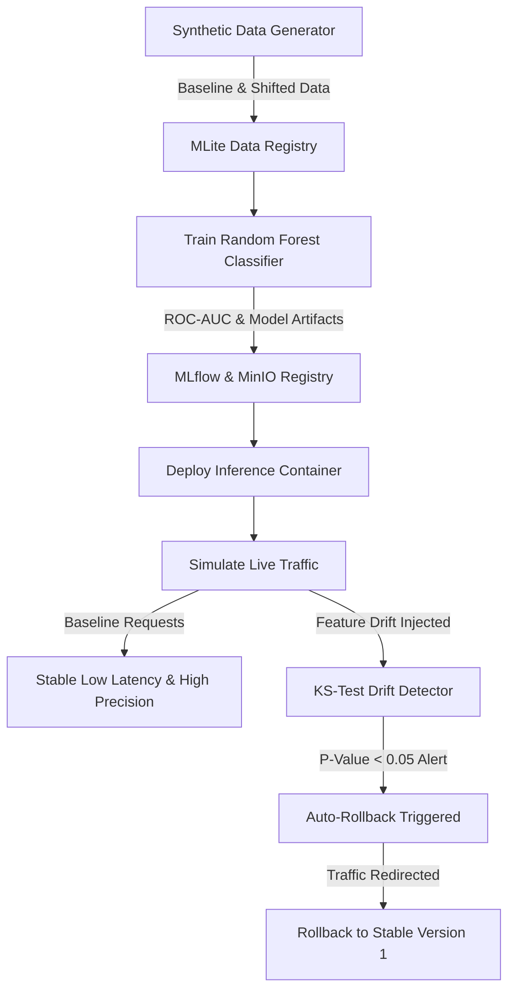

# Fraud Detection & Auto-Rollback Tutorial

This tutorial walks through building, registering, deploying, monitoring, and rolling back a real-world **Credit Card Fraud Detection** service using MLite.



---

## 1. Overview & Architecture

High-throughput transactional models suffer from sudden behavioral shifts, such as holiday spending surges or emergent scam patterns. In this tutorial, you will:

1. Generate realistic transaction datasets with fraudulent anomalies.
2. Train a baseline **Random Forest** fraud classifier logged to MLflow and MinIO.
3. Deploy the model to an isolated container with health checks.
4. Simulate live production traffic and inject synthetic feature drift.
5. Observe how MLite detects drift and triggers a safe, zero-downtime **rollback**.

---

## 2. Directory Structure

The example source code is located in [`examples/fraud-detection/`](file:///home/youssef/Music/MLOpsLite/examples/fraud-detection):

```text
examples/fraud-detection/
├── mlite.yaml
├── requirements.txt
├── README.md
└── src/
    ├── generate_data.py       # Synthesizes baseline and drifted datasets
    ├── train.py               # Trains model and logs to MLflow/MinIO
    └── simulate_traffic.py    # Simulates live HTTP traffic & injects drift
```

---

## 3. Step-by-Step Walkthrough

### Step 3.1: Environment Setup

Navigate to the project root and install required dependencies:

```bash
cd examples/fraud-detection
pip install -r requirements.txt
```

### Step 3.2: Synthesize Baseline and Shifted Data

Generate two synthetic distributions:
- `data/baseline_transactions.csv`: Normal transaction distributions (mean amount ~$65, 2% international).
- `data/shifted_transactions.csv`: Injected distribution shift (mean amount ~$145, 18% international, higher risk scores).

```bash
python src/generate_data.py
```

Register both datasets in the MLite data registry:

```bash
mlite data register --name fraud-baseline --path data/baseline_transactions.csv --description "Q1 Baseline Transactions"
mlite data register --name fraud-shifted --path data/shifted_transactions.csv --description "Drifted holiday traffic"
```

### Step 3.3: Train and Log the Classifier

Execute the training script:

```bash
python src/train.py
```

The script performs:
- Stratified train-test splitting (imbalanced target handling).
- Hyperparameter tuning (`n_estimators=100`, `class_weight='balanced'`).
- Calculates **ROC-AUC**, **PR-AUC**, and **F1-Score**.
- Logs metrics and artifacts directly to MLflow and MinIO under run name `fraud-detector-v1`.

Register the resulting model in MLite:

```bash
mlite models register \
  --name fraud-detector \
  --version 1 \
  --artifact-uri "s3://mlite-models/fraud-detector/v1/model.pkl" \
  --framework scikit-learn \
  --description "Baseline Fraud Random Forest Classifier"
```

### Step 3.4: Deploy Version 1 to Production

Create a deployment for `fraud-detector` version 1:

```bash
mlite deployments create \
  --name fraud-detector-prod \
  --model fraud-detector \
  --version 1 \
  --port 8100 \
  --env "THRESHOLD=0.75"
```

Verify deployment health:

```bash
mlite deployments list
curl -s http://localhost:8100/health
```

Output:
```json
{
  "status": "healthy",
  "model_name": "fraud-detector",
  "version": "1",
  "uptime_seconds": 12
}
```

### Step 3.5: Deploy a Faulty or Experimental Version 2

Suppose an engineer trains and deploys a candidate version 2 with experimental aggressive features:

```bash
mlite models register \
  --name fraud-detector \
  --version 2 \
  --artifact-uri "s3://mlite-models/fraud-detector/v2/model.pkl" \
  --framework scikit-learn \
  --description "Experimental aggressive fraud model"

mlite deployments update fraud-detector-prod --version 2
```

### Step 3.6: Simulate Traffic & Drift Injection

Run the simulation script to test both normal queries and injected distribution shifts:

```bash
python src/simulate_traffic.py --port 8100
```

During Phase 1, the script sends regular transactions:
```text
Phase 1: Sending Normal Baseline Transactions...
  Tx #01: amount=$45.20, intl=0 → Prediction: [0]
  Tx #02: amount=$12.80, intl=0 → Prediction: [0]
```

During Phase 2, foreign transactions with severe distribution shift are sent:
```text
Phase 2: Injecting Distribution Shift (International Surge & Large Amounts)...
  Drifted Tx #01: amount=$850.00, intl=1 → Prediction: [1]
  Drifted Tx #02: amount=$1240.50, intl=1 → Prediction: [1]
```

The Kolmogorov-Smirnov test alerts with $p < 0.05$ on `amount` and `risk_score`:
```text
⚠ HIGH Feature Drift Detected!
Affected Features: amount, is_international, risk_score
Drift Score (p-value): 0.0018 (Threshold: 0.05)
Triggered Alert: HIGH — Model Degradation Risk
```

### Step 3.7: Safe Rollback to Version 1

Revert the deployment back to the proven stable version 1:

```bash
mlite rollback fraud-detector-prod \
  --to 1 \
  --reason "Severe feature drift detected during traffic simulation"
```

Output:
```text
✔ Rollback initiated for deployment 'fraud-detector-prod'
  Current Version: 2
  Target Version: 1
  Rollback Policy: immediate
✔ Health check passed on target version 1
✔ Traffic routed to stable container. Deployment state: ACTIVE
```

Verify the audit trail:

```bash
mlite audit list --action ROLLBACK --limit 1
```

---

## 4. Key Takeaways

- **Drift Monitoring**: Continuous KS-testing against registered baselines protects inference pipelines from silent degradation.
- **Rollback Guard**: MLite ensures instant, automated or CLI-driven rollbacks with zero traffic loss.
- **Auditing**: Every rollback is immutably logged with timestamp, user identity, and rationale.
